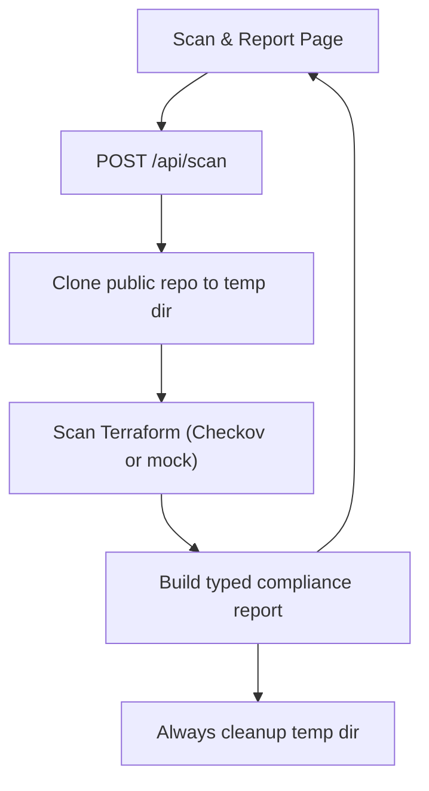

## 1. Product Overview
A web app that scans Terraform in any public GitHub repo for compliance findings.
You paste a repo URL, run a scan, and get a typed report with guaranteed temp cleanup.

## 2. Core Features

### 2.1 Feature Module
Our requirements consist of the following main pages:
1. **Scan & Report Page**: repo input, scan controls, scan progress, compliance report view, export.

### 2.2 Page Details
| Page Name | Module Name | Feature description |
|-----------|-------------|---------------------|
| Scan & Report Page | Repo Input | Validate and accept a public GitHub repo URL (optionally branch/commit and subpath). |
| Scan & Report Page | Scan Controls | Start scan; disable re-run while scanning; show scan start time and duration when done. |
| Scan & Report Page | Progress & Errors | Show in-progress state (steps: clone → discover Terraform → scan → report); show actionable error messages (invalid URL, clone failed, scan failed). |
| Scan & Report Page | Report Summary | Display overall pass/fail, totals (files, checks, passed/failed/skipped), and scan metadata (repo, ref, scanner used). |
| Scan & Report Page | Findings Table | List findings with severity, check ID, file path, line range (if available), message, and remediation hint; allow quick filtering by status/severity. |
| Scan & Report Page | Export | Copy/download the full typed JSON report for downstream pipelines. |

## 3. Core Process
You open the app, paste a public GitHub repo URL, and click “Scan”. The app calls a server API that clones the repo into a temporary directory, scans Terraform (Checkov or mock scanner), returns a typed compliance report, and always deletes the temp directory even on failures. You then review findings and export the JSON.

