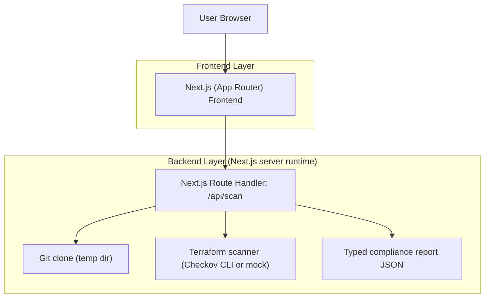
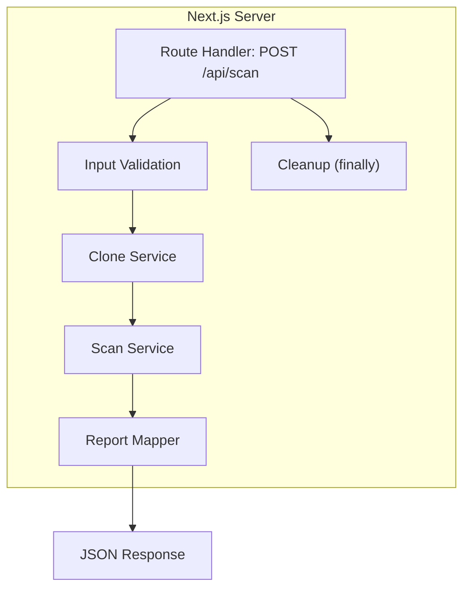

## 1.Architecture design


## 2.Technology Description
- Frontend: Next.js (App Router) + React + Tailwind CSS
- Backend: Next.js Route Handlers (Node.js runtime)
- Scanner: Checkov via CLI (optional) OR in-process mock Terraform checks

## 3.Route definitions
| Route | Purpose |
|-------|---------|
| / | Single-page UI to configure scan, run scan, and view/export report |
| /api/scan | Server endpoint that clones repo, scans Terraform, returns typed report, and always cleans temp dirs |

## 4.API definitions (If it includes backend services)
### 4.1 Core API
```
POST /api/scan
```

Request (JSON)
| Param Name | Param Type | isRequired | Description |
|-----------|------------|------------|-------------|
| repoUrl | string | true | Public GitHub HTTPS URL (e.g., https://github.com/org/repo) |
| ref | string | false | Branch, tag, or commit SHA (default: default branch) |
| subpath | string | false | Scan only within this repo subfolder |
| scanner | "checkov" \| "mock" | false | Force scanner mode (default: "mock" if Checkov unavailable) |

Response (JSON)
| Param Name | Param Type | Description |
|-----------|------------|-------------|
| report | ComplianceReport | Typed compliance report |

Shared TypeScript types
```ts
export type ScannerType = "checkov" | "mock";
export type Severity = "LOW" | "MEDIUM" | "HIGH" | "CRITICAL";

export type FindingStatus = "FAILED" | "PASSED" | "SKIPPED";

export interface ComplianceFinding {
  id: string;              // stable identifier (e.g., checkov id or mock rule id)
  title: string;
  status: FindingStatus;
  severity: Severity;
  filePath: string;
  lineStart?: number;
  lineEnd?: number;
  message: string;
  remediation?: string;
}

export interface ComplianceSummary {
  filesScanned: number;
  total: number;
  passed: number;
  failed: number;
  skipped: number;
  highestSeverity?: Severity;
}

export interface ComplianceReport {
  repoUrl: string;
  ref?: string;
  subpath?: string;
  scanner: ScannerType;
  startedAt: string;       // ISO
  finishedAt: string;      // ISO
  durationMs: number;
  summary: ComplianceSummary;
  findings: ComplianceFinding[];
}
```

Implementation notes (non-exhaustive)
- The route handler must create a unique temp directory per request.
- Repo clone + scan must run inside a `try { ... } finally { cleanup }` so temp dirs are always deleted.
- For Checkov mode: execute `checkov` against the checked-out directory and map output to `ComplianceFinding`.
- For mock mode: perform basic Terraform discovery and rule checks (e.g., insecure defaults, missing tags) and emit `ComplianceFinding`.

## 5.Server architecture diagram (If it includes backend services)


## 6.Data model(if applicable)
No database is required for a minimal viable version because reports are generated on-demand and returned immediately.